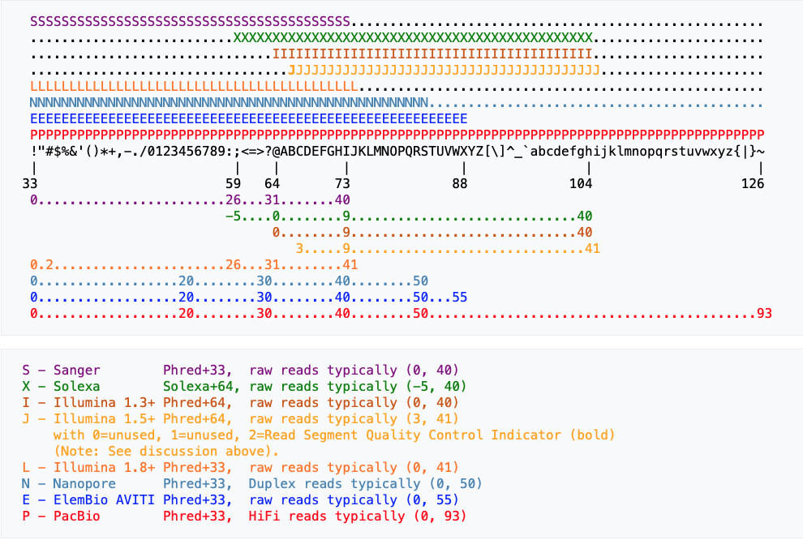

hello Amplicon!


# WORK FLOW

## Fastq format




### Reads count

> [!Tip]
> Count of reads
```
 files=`ls ./fastq/*_S*_L001_R1_001.fastq.gz`
 ${HOME}/biotools/local/assembly/bin/seqkit stats $files > out.txt

 perl -F'\s+' -anle 'BEGIN{ $info={}; } next if (/^file/);  $file= $1 if ($F[0]=~/.*\/(\S+)$/); $lib= $1 if ($file=~/^(\S+)-P_S\d+_L001_R1_001.fastq.gz/); print "$lib\t$file\t$F[3]\t$F[4]\t$F[6]"; END{ }' out.txt

```


### 1. COMBINING PAIRED-END

> [!Note]
> RAWデータが"fastqディレクトリー"にある前提

```
 mkdir pear; \
  for i in ./fastq/*_L001_R1_001.fastq.gz; do a=$i; \
   j=${i##./*/}; k=${j%%-P_S*_L001_R1_001.fastq.gz}; echo "$k";
  $HOME/biotools/local/assembly/pear-0.9.10-bin-64/pear-0.9.10-bin-64 \
    -f $i -r ${i/_R1/_R2} -o ./pear/${k}_pear -j 12; \
 done

```

`OUTPUT:` ./pear/*_pear.assembled.fastq

### 2. REMOVE PRIMER
    -V4-V5

```
export PATH="/home/impact/biotools/rhel6/miniconda3/bin:$PATH"
mkdir cleanup; \
 for i in ./pear/*_pear.assembled.fastq; do a=$i; \
    j=${i##./*/}; k=${j%%_pear.assembled.fastq}; a=$i; echo "$k"; \
 cutadapt -j 12 -e 0.1 -g file:$HOME/Desktop/work_pop/bin/primer_fwd_iupac.fas -n 5 \
   -o out.fastq $i; \
 cutadapt -j 12 -e 0.1 -a file:$HOME/Desktop/work_pop/bin/primer_rev_iupac_comp.fas -n 5 \
   -o ./cleanup/${k}_pear_noprim.fq out.fastq; \
 done
```

`OUTPUT:` ./cleanup/*_pear_noprim.fq


### 3. FILTER QC & LENGTH
   
```
for i in ./cleanup/*_pear_noprim.fq; do a=$i; \
    j=${i##./*/}; k=${j%%_pear_noprim.fq}; a=$i; echo "$k"; \
 $HOME/Desktop/work_pop/bin/pickup_qc_fastq.pl -se ./cleanup/${k}_pear_noprim.fq \
        -qc 30 0.98 -minlen 100 -maxlen 550; \
 mv out_pickup_R1_SE.fq ./cleanup/${k}_pear_noprim_qc.fq; \
 done

```

`OUTPUT:` ./cleanup/*_pear_noprim_qc.fq


> [!Tip]
> Count of reads

```
 files=`ls ./cleanup/*_pear_noprim_qc.fq`
 ${HOME}/biotools/local/assembly/bin/seqkit stats $files > out.txt

 perl -F'\s+' -anle 'BEGIN{ $info={}; } next if (/^file/);  $file= $1 if ($F[0]=~/.*\/(\S+)$/); $lib= $1 if ($file=~/^(\S+)_pear_noprim_qc.fq/); print "$lib\t$file\t$F[3]\t$F[4]\t$F[6]"; END{ }' out.txt

```

> [!Tip]
> Statics of reads

```
manu_fastq.pl -e stat -s ./cleanup/XXX_pear_noprim_qc.fq

```


## QIIME2


```
conda3
conda activate qiime2-amplicon-2024.5

(qiime2-amplicon-2024.5) mkdir qiime
(qiime2-amplicon-2024.5) mv ./qiime
```

### 1 MAKE sample-manufest

```
echo -e "sample-id\tabsolute-filepath" > sample-manufest; \
  echo -e "sample-id\tocean\tpublish" > sample-metadata.tsv; \
 for i in ../cleanup/*_pear_noprim_qc.fq; do j=${i##../*/}; \
   k=${j%%_pear_noprim_qc.fq}; id=${k//-/.};
   dir=$( cd ${i%/*_pear_noprim_qc.fq}; pwd); abpath="${dir}/${j}"; \
   echo "${id} $abpath"; \
  echo -e "${id}\txxx\tyyy" >> sample-metadata.tsv; \
  echo -e "${id}\t$abpath" >> sample-manufest; \
  done
```

`OUTPUT:`   
sample-manufest        ###  サンプルIDとfastqのPATH  
sample-metadata.tsv    ###  サンプルIDとメタ情報  

### 2 IMPORT FASTQ

```
qiime tools import --type SampleData[SequencesWithQuality] \
 --input-path sample-manufest \
 --output-path sequence.qza \
 --input-format SingleEndFastqManifestPhred33V2
```

`OUTPUT:`  
sequence.qza


### 3 DADA2

```
qiime dada2 denoise-single \
 --i-demultiplexed-seqs sequence.qza \
 --p-trim-left 0 \
 --p-trunc-len 0 \
 --o-representative-sequences rep-seqs-dada2.qza \
 --o-table table-dada2.qza \
 --o-denoising-stats stats-dada2.qza \
 --p-n-threads 24
```

`OUTPUT:`  
 rep-seqs-dada2.qza  
 table-dada2.qza  


### 4 CHIMERA
 Identifying and filtering chimeric feature sequences with q2-vsearch

```
qiime vsearch uchime-denovo \
  --i-table table-dada2.qza \
  --i-sequences rep-seqs-dada2.qza \
  --output-dir uchime-dn-out
```

`OUTPUT:`  
  ./uchime-dn-out/nonchimeras.qza  
  ./uchime-dn-out/chimeras.qza  
  ./uchime-dn-out/stats.qza  

```
qiime feature-table filter-features \
  --i-table table-dada2.qza \
  --m-metadata-file uchime-dn-out/chimeras.qza \
  --p-exclude-ids \
  --o-filtered-table uchime-dn-out/table-nonchimeric-w-borderline.qza
 qiime feature-table filter-seqs \
  --i-data rep-seqs-dada2.qza \
  --m-metadata-file uchime-dn-out/chimeras.qza \
  --p-exclude-ids \
  --o-filtered-data uchime-dn-out/rep-seqs-nonchimeric-w-borderline.qza
 qiime feature-table summarize \
  --i-table uchime-dn-out/table-nonchimeric-w-borderline.qza \
  --o-visualization uchime-dn-out/table-nonchimeric-w-borderline.qzv
  
  mv ./uchime-dn-out/table-nonchimeric-w-borderline.qza table-dada2-nochim.qza
  mv ./uchime-dn-out/rep-seqs-nonchimeric-w-borderline.qza rep-seqs-dada2-nochim.qza
```

`OUTPUT:`  
  table-dada2-nochim.qza  
  rep-seqs-dada2-nochim.qza  


### 5 CLUSTERING (OTU)

```
qiime vsearch cluster-features-de-novo \
 --i-table table-dada2-nochim.qza \
 --i-sequences rep-seqs-dada2-nochim.qza \
 --p-perc-identity 0.97 \
 --o-clustered-table table-dn-97.qza \
 --o-clustered-sequences rep-seqs-dn-97.qza \
 --p-threads 16
```

`OUTPUT:`  
  table-dn-97.qza  
  rep-seqs-dn-97.qza  


### 6 TAXONOMY ASSIGNMENT

```
qiime feature-classifier classify-sklearn \
  --i-classifier $HOME/biotools/local/population/qiime2/ref/qiime2-amplicon-2024.5/SILVA_138.2_SSURef_NR99_tax_silva_trunc-classifier.qza \
  --i-reads rep-seqs-dada2-nochim.qza \
  --p-n-jobs 24 \
  --o-classification taxonomy.qza
```


### 7 EXPORT DATA (BIOM => COUNT TABLE)

   **REPRESENT FAST**

```
 qiime tools export --input-path rep-seqs-dada2-nochim.qza --output-path output
```

`OUTPUT:`  
        ./output/dna-sequences.fasta  

***   カウントテーブル   ****
      sample-map.txtは、sample-metadata.tsvのヘッダーに#を付加したもの 
      
```
 perl -pe 's/sample-id/#sample-id/' sample-metadata.tsv > sample-map.txt
 qiime tools export --input-path table-dada2-nochim.qza --output-path output
 biom convert --to-tsv --table-type "OTU table" \
       -i ./output/feature-table.biom -o ./output/feature-count-table.txt \
       -m sample-map.txt
```

`OUTPUT:`  
       ./output/feature-table.biom   
       ./output/feature-count-table.txt

***   TAXONOMY ASSIGMENT***

```
 qiime tools export --input-path taxonomy.qza --output-path output
```

`OUTPUT:`  
        ./output/taxonomy.tsv

***   ADDIN TAXON IN OTU_TABLE***

```
 perl -i -pe 's/Feature ID/OTU/' ./output/taxonomy.tsv
 perl -i -pe 's/#OTU ID/OTU/' ./output/feature-count-table.txt

 $HOME/Desktop/work_genome/bin/adding_info_list.pl -i ./output/feature-count-table.txt \
       -a ./output/taxonomy.tsv -key 0 0 -val 1
```

`OUTPUT:`  
        out_feature-count-table.txt


***   CONVERT INTO ASV NAME   ***  

```
 perl -F'\t' -anle 'BEGIN{ $info={}; $no= 0; open(OUT,">out_asv_convert.lst.txt"); } if (/>(\S+)/) { $name=$1; $no++; $num=sprintf("%.5u",$no); $nname="ASV".$num; print ">$nname"; print OUT "$name\t$nname"; } else { print "$_"; } END{ }' ./output/dna-sequences.fasta > out_asv_dna-sequences.fasta
```

`OUTPUT:`  
       out_asv_dna-sequences.fasta
       out_asv_convert.lst.txt

***   ADDING ASV & LENGTH   ***   

```
 gc_contentSkew.pl -if out_asv_dna-sequences.fasta -p gc
 $HOME/Desktop/work_genome/bin/adding_info_list.pl -i out_asv_convert.lst.txt \
       -a outgc -key 1 0 -val 1
```

`OUTPUT:`  
        out_out_asv_convert.lst.txt

```
 perl -F'\t' -anle 'BEGIN{ $info={}; open(LI,"out_out_asv_convert.lst.txt"); while(<LI>) { chomp; @item=split/\t/; $info->{$item[0]}=[@item[1..2]]; }  } if($F[0] eq "OTU") { print (join "\t",@F,"asv","len"); } else { @ii= @{$info->{$F[0]}}; print (join "\t",@F,@ii); } END{ }' out_feature-count-table.txt > out_asv_feature-count-table.txt
```

`OUTPUT:`  
       out_asv_feature-count-table.txt


##***  Visualize summary stats *** *** *** 

```
qiime metadata tabulate \
  --m-input-file stats-dada2.qza \
  --o-visualization stats.dada2.qzv
```

  stats.chim.qzvをhttps://view.qiime2.org  へPUT
##*** *** *** *** *** *** *** *** *** ***   


