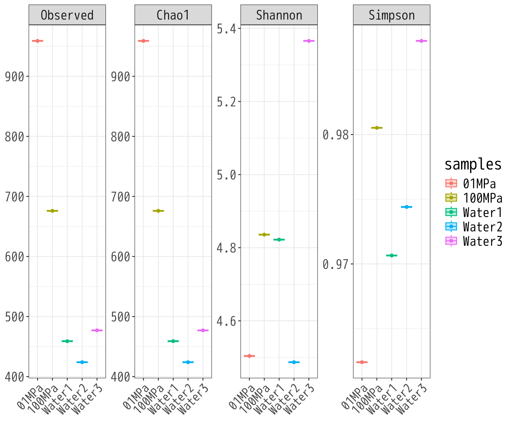
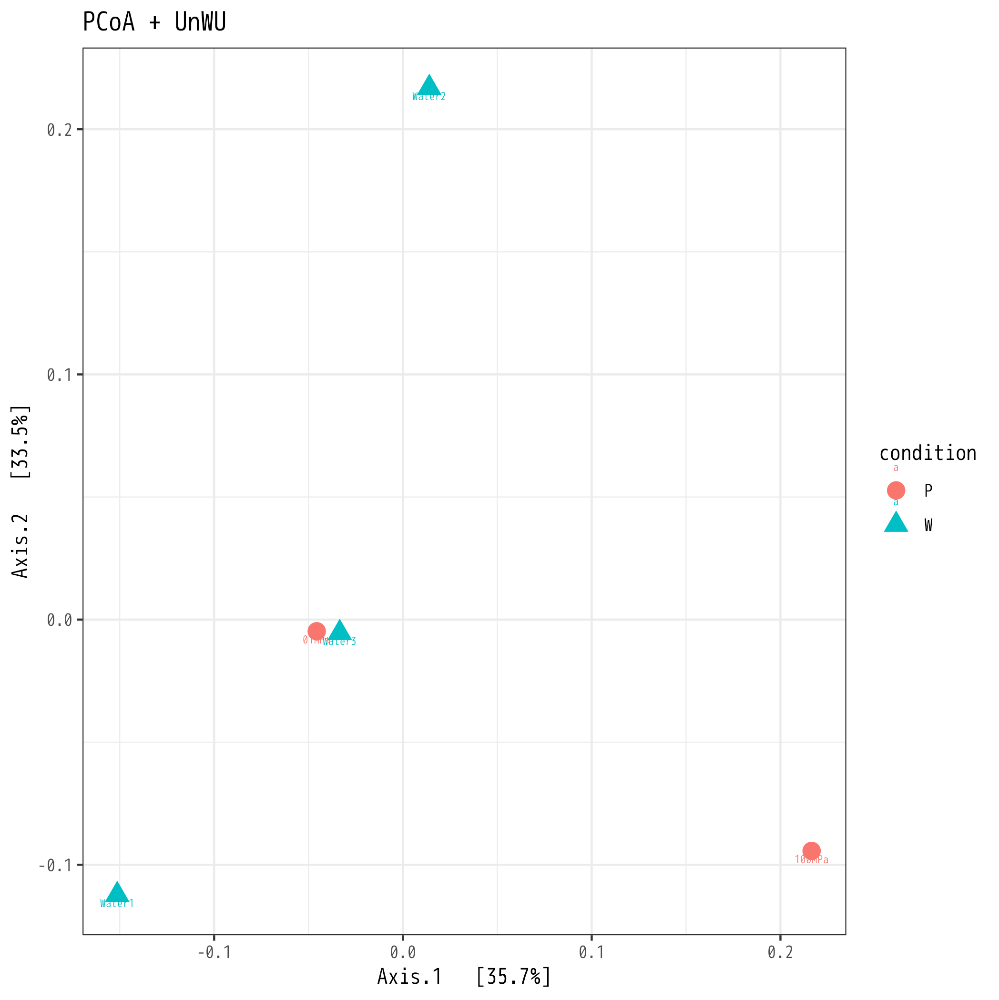
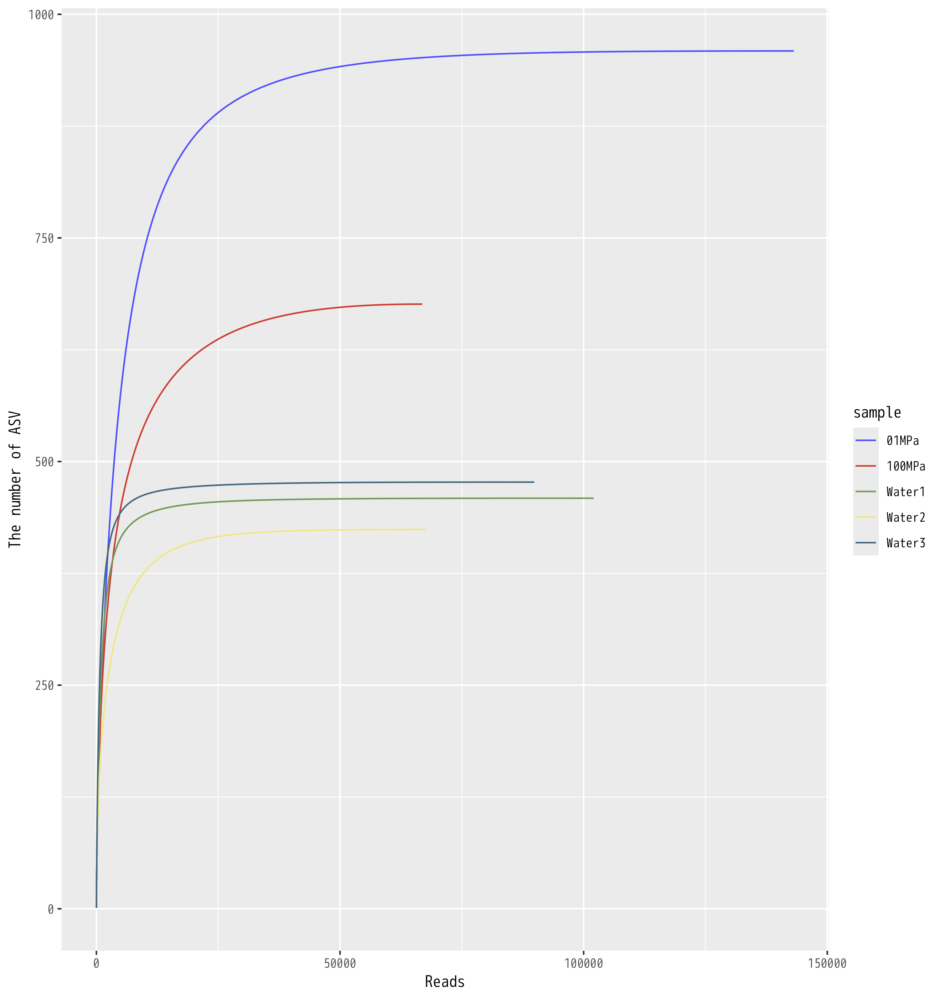
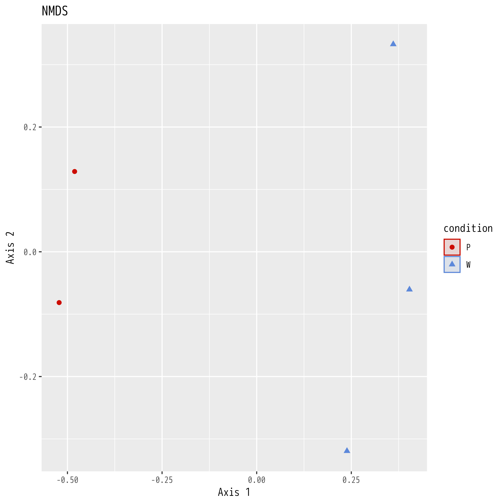

# ANALYSIS OF PHYLOSEQ


## 準備

```
$ R

library(tidyverse)

library(phyloseq)
library(MicrobeR)
library(ggplot2)
library(ggsci)

```

## Qiime2からphyloseqクラスの作成

```
library(qiime2R)

 otus <- read_qza("table-dada2-nochim.qza")
 tree <- read_qza("rooted-tree.qza")
 taxonomy <- read_qza("taxonomy.qza")
 tax_table <- do.call(rbind, strsplit(as.character(taxonomy$data$Taxon), ";"))

 colnames(tax_table) <- c("Kingdom","Phylum","Class","Order","Family","Genus","Species")
 rownames(tax_table) <- taxonomy$data$Feature.ID
 metadata <- read.table("sample-metadata.tsv", sep='\t', header=T, row.names=1, comment="")
 physeq <- phyloseq(
    otu_table(otus$data, taxa_are_rows = T),
    phy_tree(tree$data),
    tax_table(tax_table),
    sample_data(metadata)
    )

```

## 1. 細菌占有率グラフ

```
MicrobeR::Microbiome.Barplot(Summarize.Taxa(otus$data, as.data.frame(tax_table))$Family, metadata, CATEGORY="condition")
```

```
 plot_bar(physeq, x = "Sample", fill = "Phylum") + scale_fill_igv()

 ggsave("out_ps_p_bar.ps")
 ggsave("out_ps_p_bar.png")
```


## 2 α多様性グラフ

```
 p <- plot_richness(physeq, color = "samples", x = "samples", measures=c("Chao1", "Shannon"))
 p <- p + geom_boxplot(aes(fill = samples), alpha=0.3) + theme_bw() + 
    theme(
          text=element_text(size=20), 
          axis.text.x=element_text(angle=45, size=15, hjust=1), 
          axis.title.x = element_blank(), 
          axis.title.y = element_blank()
          )
 plot(p)

 ggsave("out_ps_alpha_box.ps")
 ggsave("out_ps_alpha_box.png")

```



## 3. β多様性（unweighted/weighted UniFrac）グラフ

```
 ord1 <- ordinate(physeq, method = "PCoA", distance = "unifrac")
 p1 <- plot_ordination(physeq, ord1, color = "condition", shape = "condition")
 p1 <- p1 + theme(text=element_text(size=15)) +
      geom_point(size=4) + theme_bw() +
      ggtitle("PCoA + UnWU") +
      scale_shape_discrete(limits=c("P", "W")) +
      scale_color_discrete(limits=c("P", "W"))
 plot(p1)

```
weighted UniFrac

```
 ord2 <- ordinate(physeq, method = "PCoA", distance = "wunifrac")
 p2 <- plot_ordination(physeq, ord2, color = "condition", shape = "condition")
 p2 <- p2 + theme(text=element_text(size=15)) +
      geom_point(size=4) + theme_bw() +
      ggtitle("PCoA + UnWU") +
      scale_shape_discrete(limits=c("P", "W")) +
      scale_color_discrete(limits=c("P", "W"))
 plot(p2)


 ggsave("out_ps_PCoA_wunifrac.ps")
 ggsave("out_ps_PCoA_wunifrac.png")

```



## 4 系統樹の描画

```
 plot_tree(physeq, color="condition", label.tips="taxa_names", ladderize="left", plot.margin=0.3)

 ggsave("out_ps_tree.ps")
 ggsave("out_ps_tree.png")

```

## 5. HEATMAP

```
 plot_heatmap(physeq)

 ggsave("out_ps_asv_heat.ps")
 ggsave("out_ps_asv_heat.png")


 plot_heatmap(physeq, taxa.label="Phylum")

 ggsave("out_ps_phylum_heat.ps")
 ggsave("out_ps_phylum_heat.png")

```

## 6. Rarefaction カーブ

```
 library(vegan)

 # otu_table(physeq)
 # sample_data(physeq)


 dd<-as.data.frame(otu_table(physeq))

 ps_rr <- vegan::rarecurve(as.matrix(t(dd)), step = 25, label = TRUE)

 rare <- lapply(ps_rr, function(x){
   b <- as.data.frame(x)
   b <- data.frame(ASV = b[,1], raw_read = rownames(b))
   b$raw_read <- as.numeric(gsub("N", "",  b$raw_read))
   return(b)
  })
# Label list
 names(rare) <- rownames(sample_data(physeq))
# Convert to the data frame
 rare_df <- map_dfr(rare, function(x) return(data.frame(x)), .id = "sample")


# Visualize with ggplot
 ggplot(rare_df, aes(x = raw_read, y = ASV, color = sample)) +
   geom_line() + scale_color_igv() +
   xlab("Reads") + ylab("The number of ASV")

 ggsave("out_ps_rarecurve.ps")
 ggsave("out_ps_rarecurve.png")

```



## 7. NMDS


```
# Nonmetric multidimensional scaling
 set.seed(1234)
 ps_bray <- ordinate(physeq, "NMDS", "bray")
 plot_ordination(physeq, ps_bray, color = "condition", shape = "condition") +
  stat_ellipse(geom = "polygon", alpha = 0.1, aes(fill=Method)) +
  geom_point(size = 2) + scale_color_startrek() + scale_fill_startrek() +
  xlab("Axis 1") + ylab("Axis 2") + ggtitle("NMDS")

 ggsave("out_ps_nmds.ps")
 ggsave("out_ps_nmds.png")

```




